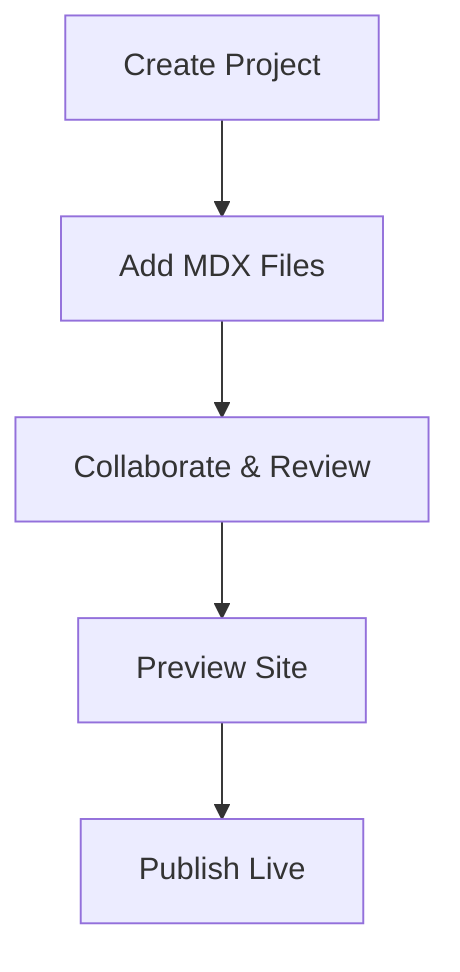

## Overview

VEERA ANKAM is your comprehensive documentation platform. You create, organize, and collaborate on project documentation with ease. Built for teams, it supports version control, search, and custom themes to streamline your workflow.

This space hosts all your project docs. You manage multiple repositories, collaborate in real-time, and publish polished documentation sites.

## What is VEERA ANKAM?

VEERA ANKAM transforms how you handle documentation. You store Markdown files, wikis, and API specs in a centralized hub. Key capabilities include:

- Hierarchical folder structures for large projects
- Real-time previews and syntax highlighting
- Integration with Git for version history

You access everything via a clean web interface or CLI tools.

<Callout kind="info">
  VEERA ANKAM uses MDX for interactive docs, enabling components like tabs and cards directly in your content.
</Callout>

## Key Features and Benefits

VEERA ANKAM offers powerful tools to boost productivity.

<Columns cols={3}>
  <Card title="Seamless Organization" icon="folder-tree" href="/docs/organization">
    Structure docs with nested folders and tags. Search across projects instantly.
  </Card>
  <Card title="Team Collaboration" icon="users" href="/docs/collaboration">
    Invite contributors, review changes, and merge updates like GitHub.
  </Card>
  <Card title="Custom Publishing" icon="globe" href="/docs/publishing">
    Generate static sites with your brand colors, like `#3B82F6`.
  </Card>
</Columns>

| Feature | Benefit |
|---------|---------|
| Real-time editing | Reduces merge conflicts |
| Full-text search | Finds content in seconds |
| Export options | PDF, HTML, or Markdown bundles |

## How to Get Started

Follow these steps to launch your first documentation site.

<Steps>
  <Step title="Create Account" icon="user-plus">
    Visit veeraankam.com and sign up with your email or GitHub account.
  </Step>
  <Step title="Set Up Project" icon="plus">
    Click "New Project" and name it, e.g., "MyApp Docs". Add your team members.
  </Step>
  <Step title="Add Content" icon="file-text">
    Upload Markdown files or use the editor. Preview changes live.
  </Step>
  <Step title="Publish" icon="rocket">
    Deploy to a custom domain. Share the live site.
  </Step>
</Steps>

### Platform-Specific Setup

<Tabs>
  <Tab title="Web UI" icon="globe">
    Use the dashboard for drag-and-drop file management.

    ```bash
    # No CLI needed - fully browser-based
    ```
  </Tab>
  <Tab title="CLI" icon="terminal">
    Install and initialize quickly.

    <CodeGroup tabs="npm,yarn">
      ```bash
      npm install -g @veeraankam/cli
      veeraankam init my-project
      ```
      ```bash
      yarn global add @veeraankam/cli
      veeraankam init my-project
      ```
    </CodeGroup>
  </Tab>
</Tabs>

## Advanced Workflow



<ExpandableGroup>
  <Expandable title="Frequently Asked Questions" default-open="false">
    ### Can I integrate with Git?
    Yes, connect your repo for automatic syncs.

    ### What file types are supported?
    Markdown, MDX, images, and code files.

    ### Is there a free tier?
    Start free, upgrade for teams >5 users.
  </Expandable>
</ExpandableGroup>

<Callout kind="tip">
  Customize your site's primary color to `#3B82F6` in project settings for brand consistency.
</Callout>