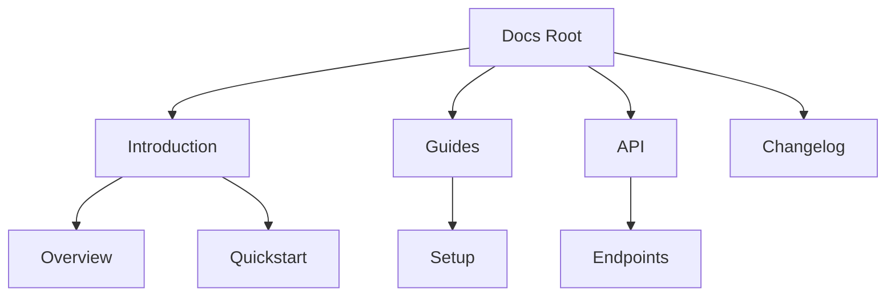

## Overview

VEERA ANKAM provides a flexible documentation space to organize your project's guides, APIs, and references. You create folders, edit pages in Markdown, and collaborate seamlessly. Follow best practices to keep your docs structured and up-to-date.

<Callout kind="tip">
  Start with a clear folder hierarchy to make navigation intuitive for your users.
</Callout>

## Structuring Folders and Pages

Organize content into logical folders like `introduction`, `guides`, and `api`. Use index pages for overviews and link related topics.

<Columns cols={2}>
  <Card title="Create Folders" icon="folder" href="#">
    Right-click in the file explorer to add new folders.
  </Card>
  <Card title="Add Pages" icon="file-text" href="#">
    Click "New Page" and select MDX for rich components.
  </Card>
  <Card title="Reorder" icon="move" href="#">
    Drag and drop to set the sidebar order.
  </Card>
  <Card title="Searchable" icon="search" href="#">
    VEERA ANKAM auto-generates search from your titles.
  </Card>
</Columns>

Use this recommended structure:

| Folder | Purpose | Example Pages |
|--------|---------|---------------|
| `/introduction` | Onboarding | overview.mdx, quickstart.mdx |
| `/guides` | Tutorials | setup.mdx, deployment.mdx |
| `/api` | References | endpoints.mdx, authentication.mdx |
| `/changelog` | Updates | releases.mdx |



<Steps>
  <Step title="Plan Hierarchy" icon="layout">
    Sketch your main sections: intro, guides, API.
  </Step>
  <Step title="Create Folders" icon="folder-plus">
    Navigate to root and add folders via the explorer.
  </Step>
  <Step title="Add Index Pages" icon="file-plus">
    Create `index.mdx` in each folder for summaries.
  </Step>
  <Step title="Link Pages" icon="link">
    Use relative links like `[Setup](../guides/setup.mdx)`.
  </Step>
</Steps>

## Collaborating with Team Members

Invite team members by email or share public links. Assign roles for editing and reviewing.

<Tabs>
  <Tab title="Editor Role" icon="edit-3">
    Full access to create, edit, and delete pages.
    
    <Callout kind="info">
      Editors see real-time previews while typing.
    </Callout>
  </Tab>
  <Tab title="Reviewer Role" icon="eye">
    View and comment without editing permissions.
    
    Use comments to suggest changes:
    
    1. Highlight text.
    2. Add note.
    3. Resolve after updates.
  </Tab>
  <Tab title="Admin Role" icon="shield">
    Manage users, settings, and versioning.
    
    <Expandable title="Invite Users">
      Go to Settings > Team > Add Member.
    </Expandable>
  </Tab>
</Tabs>

## Version Control and Updates

Integrate with Git for backups and history. Push changes from VEERA ANKAM to your repo.

<CodeGroup tabs="Git Bash,CLI">
  ```bash
  git add docs/
  git commit -m "Update authentication guide"
  git push origin main
  ```
  ```bash
  # Pull latest from repo
  git pull origin main
  # Stage all docs changes
  git add .
  git commit -m "Restructure API section"
  git push
  ```
</CodeGroup>

<Steps>
  <Step title="Connect Repo" icon="git-branch">
    In Settings, link your GitHub/GitLab repo.
  </Step>
  <Step title="Enable Auto-Sync" icon="sync">
    Toggle sync to push edits automatically.
  </Step>
  <Step title="Review History" icon="history">
    View diffs and rollback via the version panel.
  </Step>
</Steps>

<ExpandableGroup>
  <Expandable title="Advanced Git Workflow" default-open="false">
    Use branches for major updates:
    
    ```bash
    git checkout -b docs-restructure
    # Make changes in VEERA ANKAM
    git add docs/
    git commit -m "Restructure folders"
    git push origin docs-restructure
    # Create PR on GitHub
    ```
  </Expandable>
</ExpandableGroup>

Maintain docs by reviewing quarterly and using the changelog for user-facing updates. This keeps your VEERA ANKAM space professional and scalable.